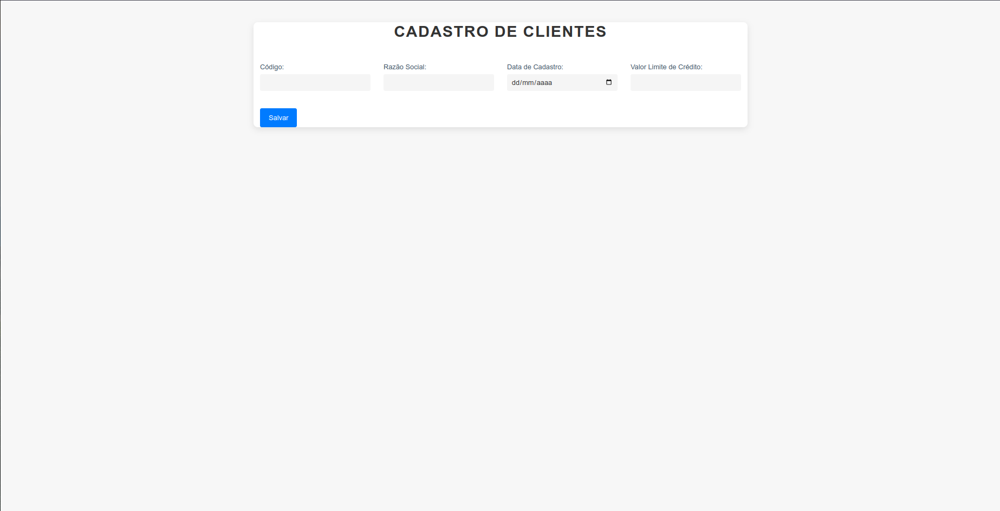
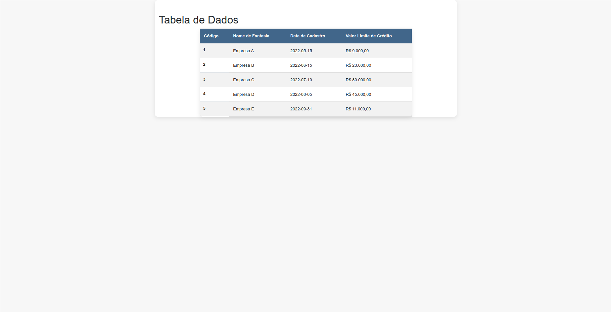

# Duas telas responsivas usando HTML, CSS e BOOTSTRAP

Uma tela em html, bootstrap e css, de um grid com os campos:
- Codigo, Razão Social, Data Cadastro e Valor Limite Crédito

Uma tela em html, bootstrap e css, de acesso a campos de uma tabela:
- Codigo, Nome de Fantasia, Data de Cadastro e valor de limite de credito

## Screenshots

